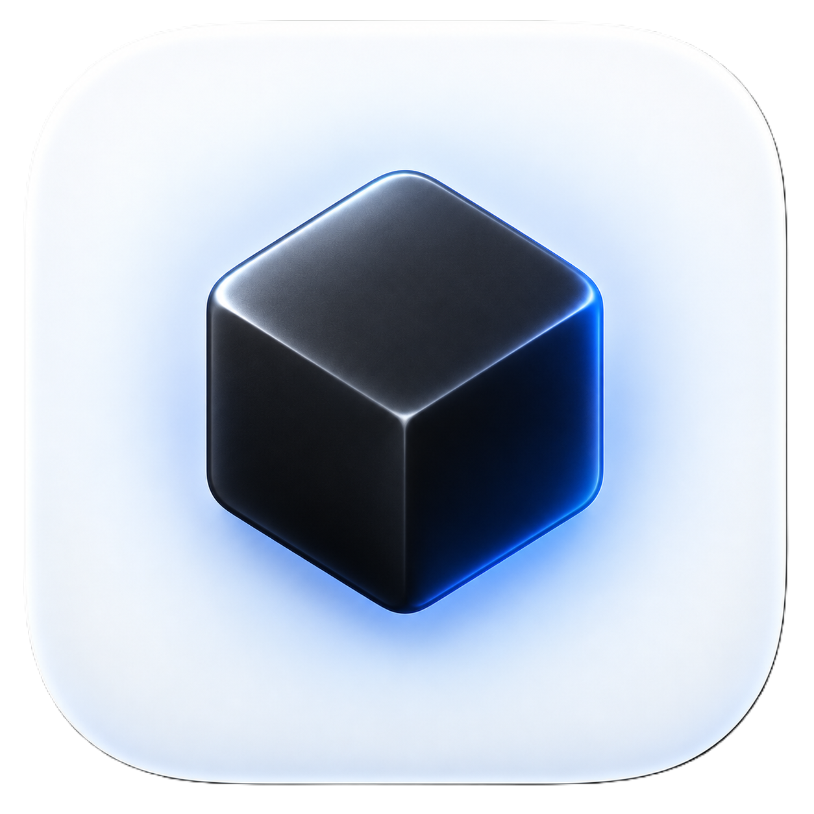
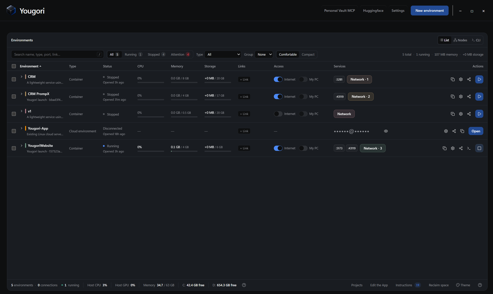
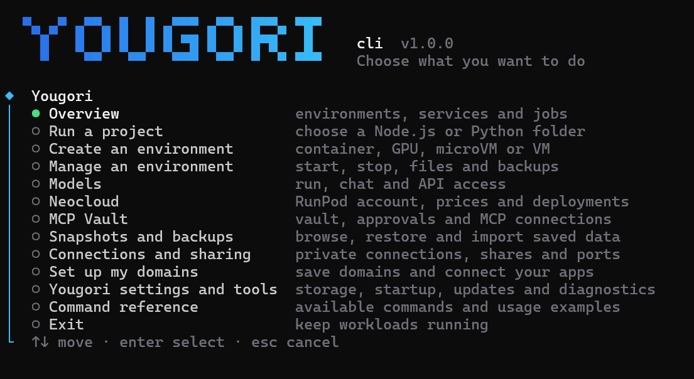
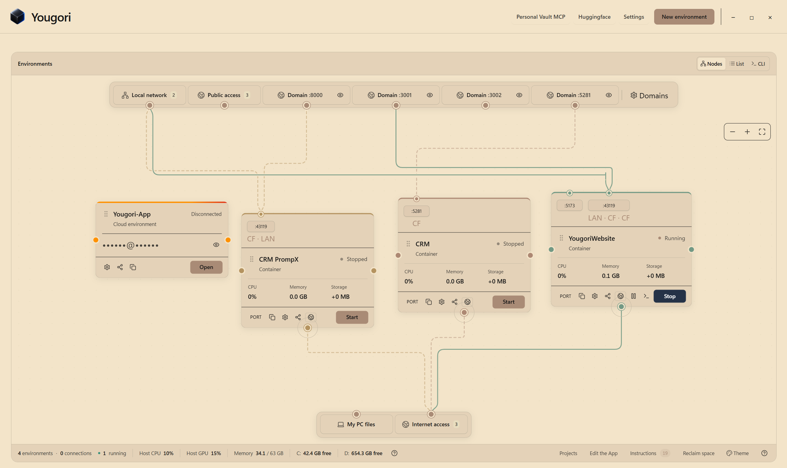

<div align="center">

<a href="https://yougori.com/"></a>

# Yougori

### Your apps. Your AI. Your choice of compute.

Start on your computer. Connect cloud servers. Add Neocloud GPUs when you need more.<br>
Run your apps, models and agents from the CLI or App, with access you control.

<br>

[](LICENSE)
[](#run-from-source)
[](package.json)

**[Website](https://yougori.com/)** &nbsp;·&nbsp; **[Discord](https://discord.gg/Eqhf4Hq3AG)** &nbsp;·&nbsp; **[X](https://x.com/withYougori)** &nbsp;·&nbsp; **[Run from source](#run-from-source)**

<br>



<br>


</div>

<br>

## What you can do

<table>
<tr>
<td width="50%" valign="top">

### Containers + VMs

Your project needs a place to run. Give it one. Keep your app and database in containers, or boot a full OS in a VM. Choose their resources and start your configured project with `npm run yougori`.

</td>
<td width="50%" valign="top">

### Local ↔︎ Cloud + Neocloud

More compute when you need it. A way home when you don’t. Work across your computer and connected Linux servers, move supported VMs between local and cloud, and use your **Neocloud** account for GPU pods, CPU pods and serverless endpoints.

</td>
</tr>
<tr>
<td valign="top">

### AI Models + Your Own API

Run the model. Own the endpoint. Choose a supported Hugging Face model, run it locally or on Neocloud compute, and chat with it. Connect your app to its OpenAI-style API with access keys you control.

</td>
<td valign="top">

### Isolated AI Agents + GPUs

An agent can do a lot. You choose what it gets access to. Give it a separate container or VM and choose the folders, networks and environments it can reach. Run GPU workloads in supported NVIDIA containers or rent Neocloud GPUs.

</td>
</tr>
<tr>
<td colspan="2" valign="top">

### Personal Vault MCP

Your agent needs a secret. It can ask you for it. Keep credentials and personal information in an encrypted vault on your computer. Connect local agents, ChatGPT and Claude through MCP, then review requests and approve access in the Windows App.

</td>
</tr>
</table>

<br>

## Start in your project

Open a terminal in your project folder and run:

```bash
cd my-project
yougori
```

Yougori opens a guided menu and adds shortcuts to supported Node.js projects. Choose the project launch option, or run `yougori launch` directly. Pick your resources, file sync and who can open your app: just you, your local network, a public link or your own domain.

When asked how to run your project, choose **`npm run dev`** if that is your project's development command. Yougori installs dependencies and runs it inside the environment, with logs and links in your terminal.

Next time, start from the same folder:

```bash
npm run yougori
```

Your setup is saved. Yougori syncs once when starting. Setup recommends **Continuously** for project folders below 2.5 GB and **On demand** for folders of 2.5 GB or more; your saved choice remains selected when editing settings. Press `y` when switching where you work: **Sync to container** sends computer changes; **Sync to this computer** brings container changes home when two-way sync is enabled. Your chosen conflict priority applies. Press `t` to open a terminal inside the environment, or `q` / Ctrl+C to stop the project container and keep its files. On-demand sessions do not sync again when quitting.

| What you want to do | Command |
| --- | --- |
| Change resources, access or file sync | `npm run yougori-change` |
| Run on a connected Linux cloud server | `npm run yougori-cloud` |
| Run a supported Python project after registering it with `yougori` | `python yougori` |
| Open the guided menu | `yougori` |

Cloud launch asks which connected server to use. That server needs Docker Engine access for its project containers. Local projects use Yougori's own runtime.

## Run a model. Make it yours.

Choose a supported Hugging Face model and give it a place to run. Start locally:

```bash
yougori model run hf.co/TinyLlama/TinyLlama-1.1B-Chat-v1.0
```

Yougori guides you through setup and opens a chat when the model is ready. To use Neocloud compute, connect your RunPod account and create or attach a GPU pod through the `yougori` menu, then run:

```bash
yougori model run hf.co/TinyLlama/TinyLlama-1.1B-Chat-v1.0 --neocloud
```

Need the model in your app? Start it with `--api`:

```bash
yougori model run hf.co/TinyLlama/TinyLlama-1.1B-Chat-v1.0 --api --port 8000
```

Use the model's environment name or ID in place of `ENV` below. `yougori ps` lists them.

| What you want to do | Command |
| --- | --- |
| Return to a conversation | `yougori model chat ENV` |
| Start a fresh conversation | `yougori model chat ENV --new` |
| Get the API key and connection addresses | `yougori model access ENV` |
| Check the model | `yougori model status ENV` |
| See API usage | `yougori model usage ENV` |
| Stop the model process | `yougori model stop ENV` |

Stopping a model on Neocloud leaves its pod billable. Manage the pod separately in the Neocloud menu.

## Give agents access you approve

Personal Vault MCP keeps credentials and personal information in an encrypted vault on your computer. Your agent requests what it needs; you review the request and approve access.

Run `yougori` and choose **MCP Vault** to open the vault, add an item, review approvals or get your MCP connection settings. Item entry and approvals use the Windows App, which is installed separately from the CLI.

For an MCP client that supports local stdio servers, use:

```json
{
  "mcpServers": {
    "yougori-vault": {
      "command": "yougori",
      "args": ["vault", "mcp"]
    }
  }
}
```

The client must be able to find `yougori` on its PATH. The MCP Vault menu can generate settings with the full executable path. For connection options and approval behavior, see [Personal Vault](docs/personal-vault.txt).

## Keep the rest within reach

Use the guided menu to create containers and VMs, manage Neocloud compute, share folders and set up connections. These commands are useful when you already know what you want:

```bash
yougori status                  # Environments, links and jobs
yougori run -it ubuntu           # Open a shell in an Ubuntu container
yougori terminal ENV             # Open a terminal in an existing environment
yougori logs ENV                 # Read its logs
yougori stop ENV                 # Stop an environment
yougori help                     # Full command reference
```

For projects with several services, describe the environments and connections in [`yougori.yaml`](examples/yougori.yaml). Run `yougori up --dry-run` to preview, `yougori up` to start, and `yougori down` to stop them without deleting their volumes.

More detail: [projects, cloud launch and models](docs/projects-and-models.txt).

<br>

## Run from source

You'll need **Git**, **Node.js 24 LTS** and **Rust stable**.

<details open>
<summary><b>Windows x64</b>: PowerShell</summary>

<br>

```powershell
git clone https://github.com/you-gori/yougori.git
Set-Location yougori
rustup default stable-x86_64-pc-windows-msvc
npm ci
npm run cli:bundle
npm run desktop:dev
```

</details>

<details>
<summary><b>Ubuntu 22.04+ x64</b>: Terminal</summary>

<br>

```bash
sudo apt update
sudo apt install -y build-essential pkg-config libwebkit2gtk-4.1-dev \
  libgtk-3-dev libayatana-appindicator3-dev librsvg2-dev patchelf \
  libssl-dev libxdo-dev qemu-system-x86 qemu-utils ovmf \
  openssh-client ca-certificates

git clone https://github.com/you-gori/yougori.git
cd yougori
npm ci
npm run cli:bundle
npm run desktop:dev
```

</details>

<details>
<summary><b>macOS 14+</b>: Terminal &nbsp;<sub>development preview</sub></summary>

<br>

```bash
git clone https://github.com/you-gori/yougori.git
cd yougori
npm ci
npm run macos:setup
npm run cli:bundle
npm run desktop:dev
```

</details>

<br>

## Documentation

| | |
| --- | --- |
| [Projects, CLI and models](docs/projects-and-models.txt) | Every command, `yougori.yaml` fields and the model runner |
| [Neocloud](docs/neocloud.md) | Renting GPUs, pods, serverless endpoints and volumes |
| [Remote sharing](docs/remote-sharing.txt) | Tunnels, domains, recipients and permission levels |
| [Personal Vault](docs/personal-vault.txt) | Encrypted credential broker for agents |
| [Build cache](docs/build-cache.md) | Faster Rust builds during development |
| [Licensing](docs/licensing.txt) | AGPL, commercial licensing and source distribution |

<br>

## License

Yougori's original code is open source under **[AGPL-3.0-only](LICENSE)**, with a **[separate commercial license](COMMERCIAL_LICENSE.txt)** available from Yougori LLC. Commercial use is allowed under the AGPL when its conditions are met. Third-party components keep their own licenses. See [NOTICE](NOTICE) and the [licensing guide](docs/licensing.txt).

<br>

<div align="center">

<a href="https://yougori.com/"></a>

<sub>Made by Yougori LLC</sub>

</div>
